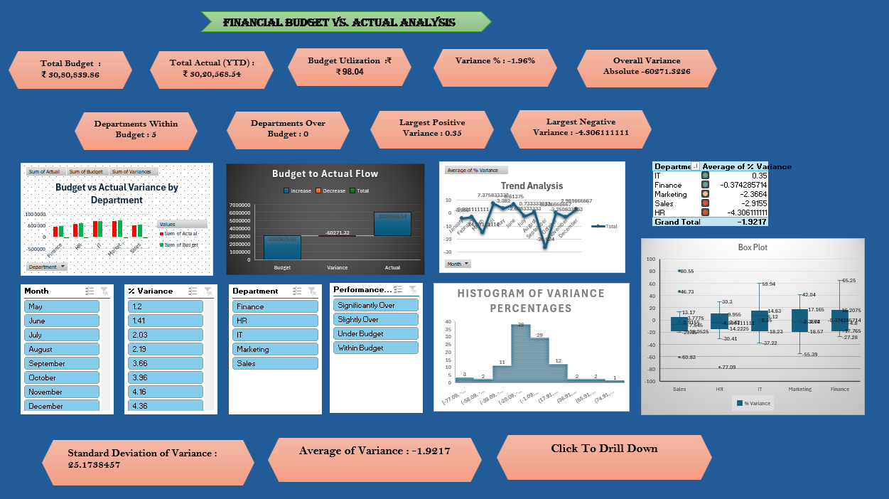
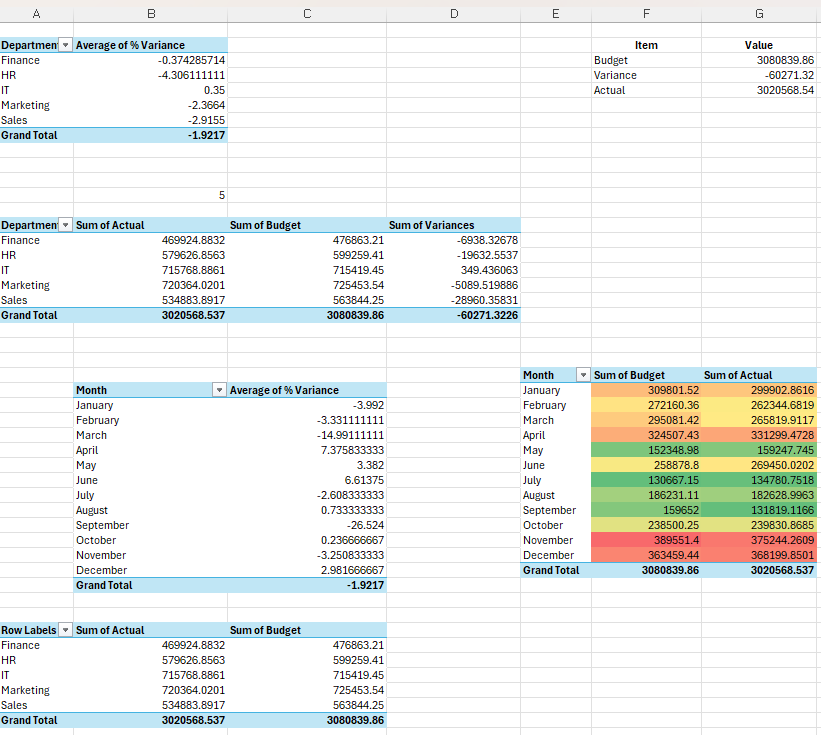

# 📊 Budget vs Actual Expense Dashboard
Interactive Excel dashboard for Budget vs Actual analysis using Pivot Tables, Pivot Charts, KPIs, and Slicers.
## 📌 Project Overview

The **Budget vs Actual Expense Dashboard** is an interactive dashboard built using **Microsoft Excel** to compare planned budgets with actual expenses across departments. It helps monitor financial performance by highlighting budget utilization, spending variance, and department-wise expenditure through dynamic charts and KPI cards.

This project demonstrates Excel dashboard development, financial analysis, and data visualization skills.

---

## 🎯 Objectives

* Compare budgeted and actual expenses.
* Monitor departmental spending performance.
* Identify over-budget and under-budget departments.
* Track budget utilization and variance.
* Provide interactive financial insights for better decision-making.

---

## 📂 Dataset

**Dataset Type:** Department Budget & Expense Data

### Dataset Includes

* Department
* Budget Amount
* Actual Expense (YTD)
* Variance
* Variance Percentage
* Budget Utilization
* Month
* Performance Status

---

## 🛠️ Tools & Techniques

* Microsoft Excel
* Pivot Tables
* Pivot Charts
* Slicers
* KPI Cards
* Conditional Formatting
* Data Cleaning
* Interactive Dashboard Design

---

## 📈 Dashboard Features

* 💰 Total Budget
* 💸 Total Actual Expenses
* 📊 Budget Utilization (%)
* 📉 Budget Variance
* 🏢 Department-wise Budget Analysis
* 📅 Monthly Expense Trends
* 🎛️ Interactive Slicers for Filtering

---

## 📌 Key Performance Indicators (KPIs)

* Total Budget
* Total Actual Expenses
* Budget Utilization (%)
* Budget Variance
* Variance Percentage

---

## 💡 Key Insights

* Compare planned and actual departmental expenses.
* Identify departments exceeding their allocated budget.
* Monitor budget utilization across the organization.
* Analyze spending trends over time.
* Support financial planning and budget control.

---

## 📁 Repository Structure

```text
Budget-vs-Actual-Expense-Dashboard/
│── DashboardProject3.xlsx
│── README.md
│── screenshots/
│   ├── dashboard.png
│   ├── kpi-summary.png
│   └── charts.png
```

---

## 🖼️ Dashboard Preview

### Main Dashboard



### KPI Summary


### Charts



---

## 🚀 Skills Demonstrated

* Financial Data Analysis
* Dashboard Development
* Microsoft Excel
* Pivot Tables
* Pivot Charts
* KPI Reporting
* Data Visualization
* Business Intelligence

---

## 🔮 Future Improvements

* Integrate SQL as the data source.
* Automate data refresh using Power Query.
* Recreate the dashboard in Power BI.
* Add forecasting and trend analysis.

---

## 👩‍💻 Author

**Ramzina M**

* GitHub: https://github.com/ramzinaa
* LinkedIn: *(Add your LinkedIn profile URL)*

---

⭐ If you found this project useful, consider giving it a **Star** on GitHub!
